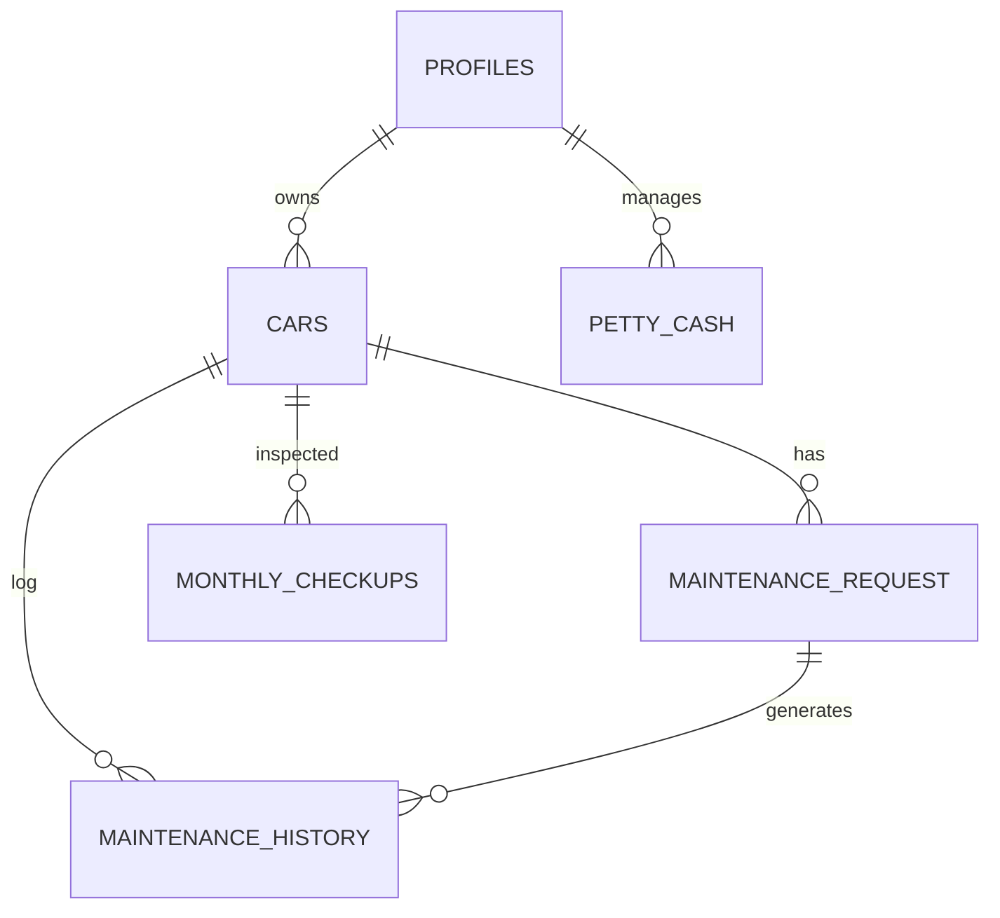

# Car Service App - Comprehensive Documentation

This document provides a detailed overview of the Car Service Application functionality, database schema, user roles, and business processes. It is intended to serve as a guide for integrating a Flutter Web App and establishing the correct business model.

---

## 1. User Roles & Permissions

The application uses a Role-Based Access Control (RBAC) system defined in the `profiles` table.

| Role | Database Value | Description | Responsibilities |
| :--- | :--- | :--- | :--- |
| **Employee** | `employee` | Default User | • Owns Cars • Submits Maintenance Request • Manages Petty Cash Expenses |
| **Cars Admin** | `cars_admin` | Fleet Manager | • Views/Manages All Cars • Approves/Manages Maintenance Requests • Views/Manages Reports |
| **Accountant** | `accountant` | Financial Manager | • Manages Petty Cash Allocations • Reviews Expenses • Views Financial Reports |
| **Warehouse Keeper** | `warehouse_keeper`| Inventory Manager | • Manages Tools & Inventory • (Scope to be expanded for parts inventory) |

### Role Implementation Details
- **Auth Trigger**: When a user signs up via Supabase Auth, a trigger `on_auth_user_created` automatically creates an entry in the `profiles` table.
- **Metadata**: Roles are initially passed via user metadata during signup but enforced by the database trigger fallback to `employee`.

---

## 2. Key Entities & Data Models

### A. Profiles (Users)
- **Table**: `profiles`
- **Key Fields**: `id` (PK, matches Auth ID), `role`, `name`, `email`.
- **Relations**: Parent to Cars, Tools, and Petty Cash transactions.

### B. Cars
- **Table**: `cars`
- **Key Fields**: `id`, `model`, `number`, `owner_id` (FK -> profiles), `status`, `location` ('Ahsaa', 'Dammam').
- **Purpose**: Certain employees possess cars. All maintenance logic revolves around this entity.
- **RLS Policy**: Employees only see *their* cars. Admins see *all* cars.

### C. Maintenance Request
- **Table**: `maintenance_request`
- **Key Fields**:
    - `car_id` (FK -> cars)
    - `status`: `pending` -> `in_progress` -> `completed`
    - `requested_at`, `completed_at`
    - Service Flags: `oil_change`, `brake_pads`, `spark_plugs`, `tyres`, etc.
- **Process**:
    1. Employee creates a request for their car.
    2. Request is created with status `pending`.
    3. Admin/Technician updates status to `in_progress` and eventually `completed`.

### D. Maintenance History
- **Table**: `maintenance_history`
- **Key Fields**:
    - `car_id` (FK -> cars)
    - `request_id` (FK -> maintenance_request, optional)
    - `maintenance_type` (Enum: oilChange, brakePads, etc.)
    - `performed_at`, `cost`, `kilometers`
- **Purpose**: An immutable log of all work done. When a request is completed, entries should be added here for historical tracking.

### E. Petty Cash System
- **Table**: `petty_cash` ( inferred from schema/code)
- **Key Fields**:
    - `employee_id` (FK -> profiles)
    - `type`: `allocation` (Money given to employee) or `expense` (Money spent).
    - `amount`, `category`, `receipt_url`.
    - `allocation_id`: Self-referencing FK. Links an `expense` to the specific `allocation` fund it used.
- **Process**:
    1. **Allocation**: Accountant creates a transaction of type `allocation` for an Employee.
    2. **Expense**: Employee creates a transaction of type `expense`, linked to the `allocation`.
    - **Balance Calculation**: `Total Allocations - Total Expenses` for a specific user.

### F. Monthly Checkups
- **Table**: `monthly_checkups`
- **Purpose**: A granular checklist (30+ fields) for routine vehicle inspections (Engine, Transmission, Brakes, etc.).
- **Relations**: Linked to `cars`.

---

## 3. Database Relations & Joins (Integration Guide)

When building the Web App Business Model, ensure these relations are respected.

### Primary Layout (ERD Concept)

### Critical Foreign Keys for Joins
1. **User Data**: Join `profiles` on `auth.users.id`.
2. **Car Ownership**: Join `cars` on `cars.owner_id = profiles.id`.
3. **Maintenance Flow**: 
   - `maintenance_request.car_id` -> `cars.id`
   - `maintenance_history.request_id` -> `maintenance_request.id` (To see which request caused this history entry).
4. **Financials**:
   - `petty_cash.employee_id` -> `profiles.id` (Who spent/received money).

---

## 4. Business Processes & Logic

### 1. The Maintenance Cycle
1. **Initiation**: Employee submits `MaintenanceRequest` specifying services (e.g., Oil Change, Brakes).
2. **Review**: Admin views pending requests.
3. **Execution**: Status moves to `in_progress`.
4. **Completion**: 
   - Status moves to `completed`.
   - `completed_at` is set.
   - **Crucial**: Corresponding entries should be written to `maintenance_history` and `oil_change_progress` (if oil was changed) to update the car's current stats (KM, Last Service Date).

### 2. Financial Tracking
- **Revenue**: Currently defined as "Allocations" (Funds injected into the system).
- **Expenses**: Money spent by employees + Maintenance Costs.
- **Reporting**: The `FinancialReport` entity aggregates:
    - *Petty Cash Ops* (Allocations vs Expenses).
    - *Maintenance Costs* (derived from maintenance history costs).

---

## 5. Web App Integration Notes

To integrate a Flutter Web App for the **Management/Admin** side:

1. **Authentication**:
   - Use the same Supabase project.
   - Web App login will generate the same Auth Token.
   - **Role Check**: On the Web App, check `profile.role` immediately after login. Only allow `cars_admin`, `accountant`, or `warehouse_keeper` to access the dashboard.
   
2. **Data Access (RLS)**:
   - The Row Level Security protocols are already set in `supabase_schema.sql`.
   - **Admins** have policies allowing them to `SELECT` all rows in `cars` and `maintenance_requests`.
   - **Employees** are restricted to their own data.
   - *Ensure the Web App user is logged in with an Admin role to see global data.*

3. **Shared Logic**:
   - Re-use the `domain/entities` folder if using a monorepo.
   - If separate repo, copy the exact Enums (`UserRole`, `MaintenanceRequestStatus`) to avoid data mismatches.

4. **Web-Specific Features**:
   - **Dashboards**: Query `maintenance_history` with aggregation (SUM cost, COUNT types) for analytics.
   - **Bulk Actions**: The Web App is ideal for bulk status updates or CSV exports of `financial_reports`.
